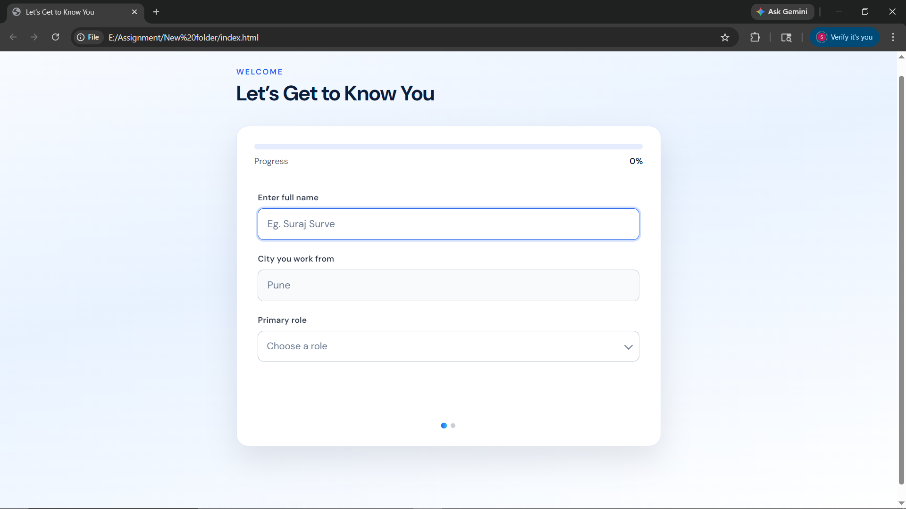
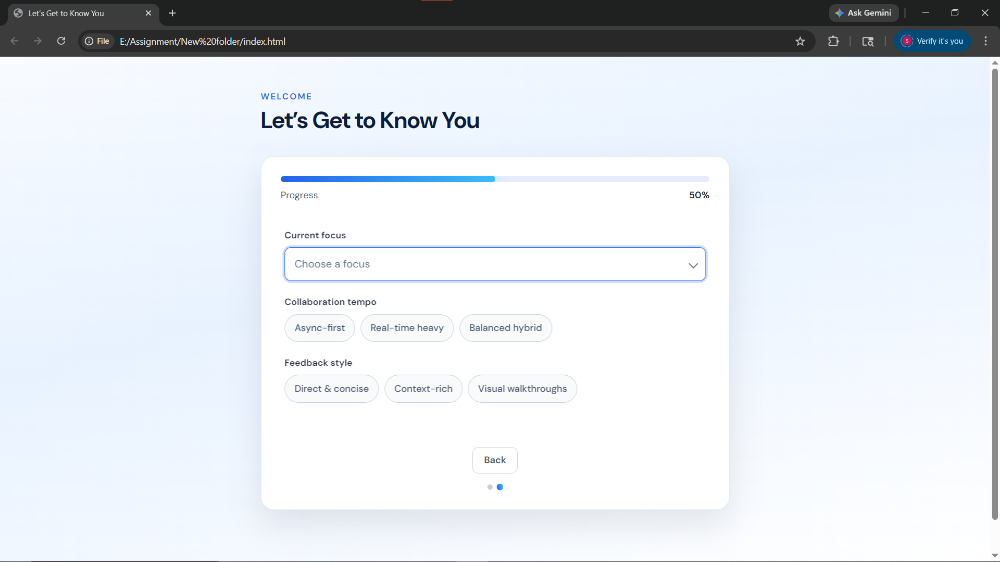
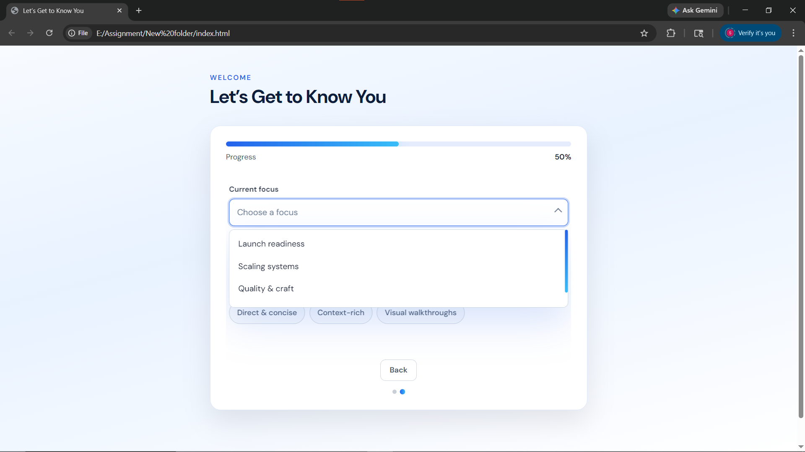
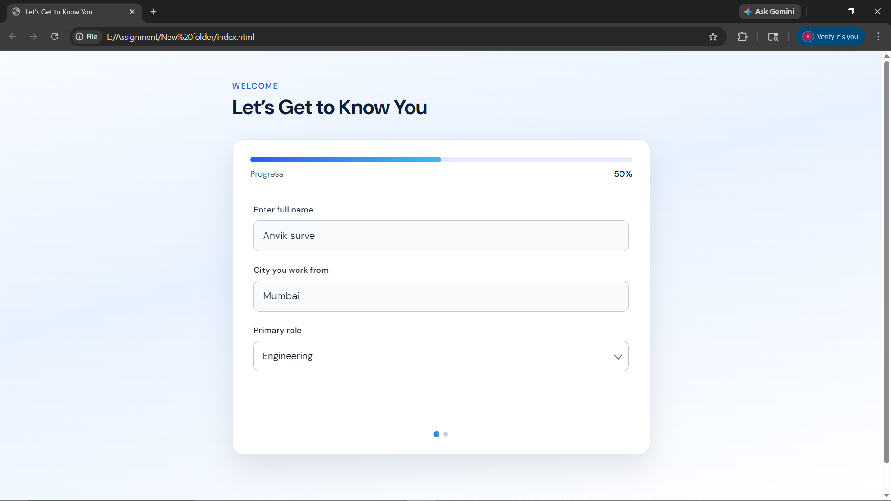
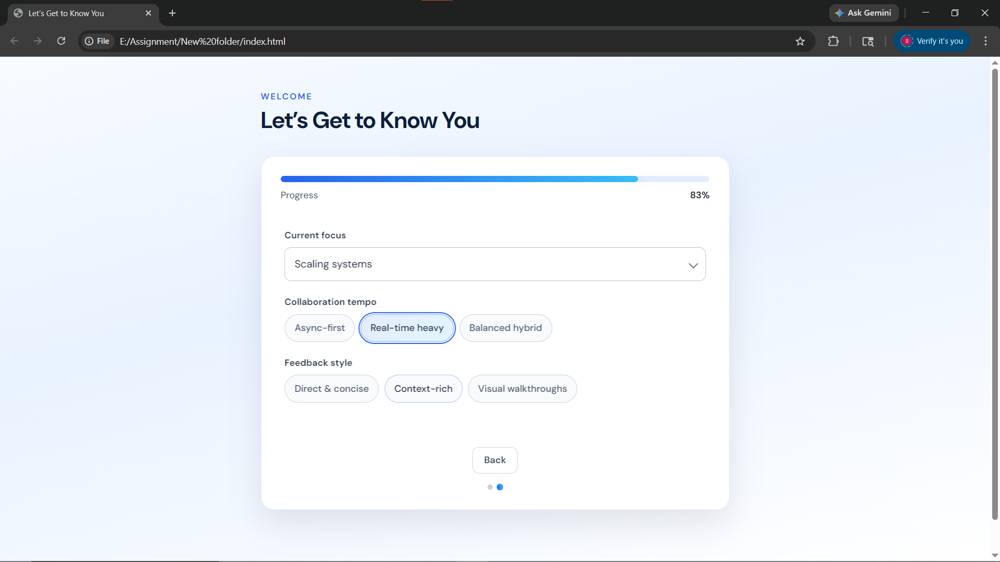
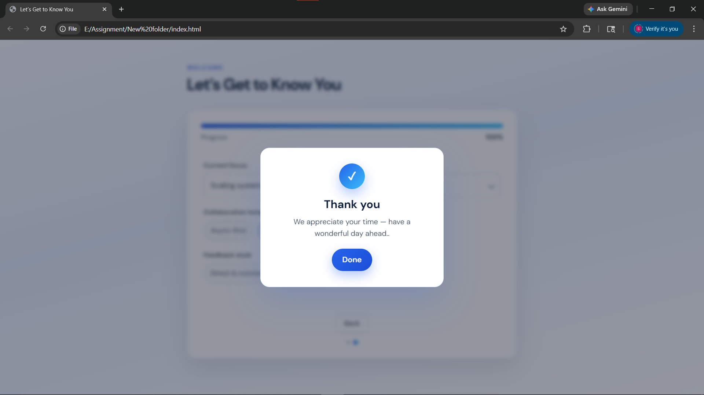

# 🚀 FormFlow UI

A modern multi-step form with dynamic progress tracking, custom UI components, and smooth user experience.

---

## ✨ Features

* 🧩 Multi-step form (auto navigation)
* 📊 Dynamic progress bar (real-time updates)
* 🎯 Input validation (text, select, radio)
* 🎨 Custom dropdown (no default browser select)
* ⚡ Smooth transitions & animations
* 🔄 Auto reset after completion
* 📱 Fully responsive design

---

## 🛠️ Tech Stack

* HTML5
* CSS3 (Custom UI + Animations)
* JavaScript (jQuery)

---
## 🚀 Live Demo

👉 [https://your-live-demo-link.com](https://suraj-7874.github.io/Dynamic-form-progress/)

---
## 📸 UI Preview

| Screen                             | Preview                                                      |
| ---------------------------------- | ------------------------------------------------------------ |
| **Step 1 – Input & Progress Bar**  |  |
| **Step 2 – Form with Back Button** |  |
| **Custom Dropdown Selection**      |     |
| **Filled Form State**              |     |
| **Radio Button Selection**         |              |
| **Thank You Modal**                |              |


---
## 📂 Project Structure

```
├── index.html
├── styles.css
├── app.js
├── Snapshots
└── README.md

```

---

## ⚙️ How It Works

* Tracks total inputs dynamically
* Updates progress based on completed fields
* Moves to next step automatically when conditions are met
* Shows a thank-you modal after completion
* Resets form for a fresh start

---

## 📦 Installation

Clone the repository:

```
git clone https://github.com/your-username/formflow-ui.git
```

Open `index.html` in your browser.

---

## 🌐 Deployment

You can easily deploy using:

* GitHub Pages
---

## 🎯 Use Cases

* Onboarding forms
* Survey flows
* Lead capture forms
* SaaS signup UX

---

## 💡 Future Improvements

* Form data storage (API / backend)
* Accessibility enhancements
* Dark mode support
* Typeahead search in dropdown

---

## 🤝 Contributing

Pull requests are welcome. For major changes, please open an issue first.

---

## 📄 License

This project is open-source and available under the MIT License.

---

## 🙌 Acknowledgements
check my all projects here --> https://github.com/Suraj-7874
and my resume -->https://github.com/Suraj-7874/Resume/blob/main/Suraaj_2025.pdf
Inspired by modern UX patterns and clean form experiences.

---

⭐ If you like this project, give it a star!
